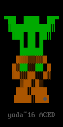
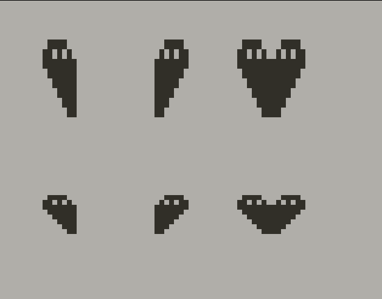
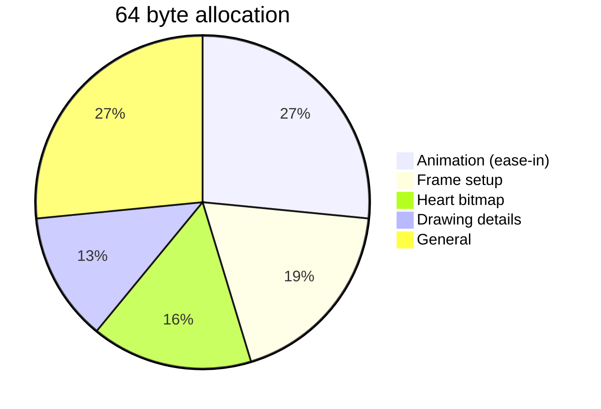

# Lovebyte 2025

First competition for 2025: [Lovebyte](https://lovebyte.party)! This year's theme is 'Blind Date'.

## 64 byte, high-end entry (PICO-8)

This is my first production that isn't focused on an effect or technique. I started with the theme and wanted to tell a story. While we may begin blind, we need fearless vision to succeed in love.

Our story is told in exactly 64 characters:

```text
With eyes wide open, our separated halves find their way as one.
```

– and animated with just 64 bytes:

```lua
--eyeswideopen 64b
--by ace-dent
while(♥)?"⁶t⁶.<𝘷◜ュヲユナらᶜeᵇb,ᶜ8𝘧⁶1⁶c1⁶!5f2c⁵",56*min(t()/3,1)^8,56
```

(Use 'punycode' mode if copy & pasting <kbd>Ctrl</kbd>+<kbd>P</kbd>).  
Downloadable rom file is [here](eyeswideopen.p8.rom) (64 bytes).

Entirely rendered in one print statement, with some crafty P8SCII control characters [(1)](https://pico-8.fandom.com/wiki/P8SCII_Control_Codes)[(2)](https://pico-8.fandom.com/wiki/P8SCII).

<br>


---

## Text graphics (ANSI CP437)

A last minute entry and my first attempt at some text mode graphics. To meet the 256 character limit, I went with a 16 x 16 image. As a starting point, I took some B/W pixel art of Yoda I made a few years ago. Initially I [prototyped](yoda~16/src/proto-yoda.p8) something in PICO-8, then wrote a shell [script](yoda~16/src/yoda.sh) to generate the ANSI stream... before discovering the program [Moebius](https://blocktronics.github.io/moebius/) that makes artwork much easier! I still used my script for the production, as I could generate much more compact ANSI code (240 bytes). 

<br>



## Acknowledgements

Compression tested with the excellent [PXA Viz](https://carlc27843.itch.io/pico-8-source-compression-visualizer) tool by @carlc27843 and [Shrinko8](https://thisismypassport.github.io/shrinko8/) by @thisismypassport. Tweaking of ANSI art done with [Moebius](https://blocktronics.github.io/moebius/) by @Blocktronics.

Special thanks to the Lovebyte organizers, esp. superogue for encouraging me to enter. My ASCII art handle was created by ne7.


## Legal

Produced by Andrew C.E. Dent and shared under MIT License; please read the separate LICENSE file.

All trademarks are the property of their respective owners. PICO-8 and Picotron are trademarks of [Lexaloffle Games LLP](https://www.lexaloffle.com/).


---


## Development: 'Eyes Wide Open'

First I created the bitmap required to tell the story. A one-off character would be used to draw the half-heart 'person'. I knew it would be effectively doubled in the x-axis by mirroring, so I would use the 'tall' mode to double pixels in the y-axis. It was helpful to sketch how this would work, using [Pulp](https://play.date/pulp/about/).



---

I wanted to continue my method of rendering everything in one print statement, but it can become quite unwieldily for development. For ease of experimenting and documentation, strings were written in stages, that would be concatenated in the final print statement.

```lua
while(♥) do

 --[[
     with eyes wide open, 
     our separated halves 
     find their way as one.
   ]]

 --setup printing
 --3% (2/64)
 a="⁶t"--tall mode (2x height)
 --set foreground colour later
	
 --heart bitmap (one-off chr)
 --16% (10/64)
 a=a.."⁶.<𝘷◜ュヲユナら"
 --"⁶:3c56fefcf8f0e0c0"

 --add pink highlight to head
 --8% (5/64)
 a=a.."ᶜeᵇb,"
 
 --add arm and set main colour 8
 --5% (3/64)
 a=a.."ᶜ8𝘧"
 
 --setup screen for next frame
 --19% (12/64)
 z="⁶1⁶c1"--flip and clear
 z=z.."⁶!5f2c⁵"--set v-mirror screen mode (5)
 
 --render heart, ease-in
 --38% (24/64)
 -- mid point is 56 (64-8)
 ?a..z,56*min(t()/3,1)^8,56
end
```

For the final release, all strings were combined, then the code iterated on to meet the size limit. It was published as a 'tiny' ROM using the `export -t eyeswideopen.rom.p8` [option](http://www.sizecoding.org/wiki/PICO-8#Tiny_ROM_Export). It was also convenient to publish the tiny ROM using [Shrinko8](https://thisismypassport.github.io/shrinko8/).

The byte allocation breaks down as:



Quite a few bytes were allocated to the animation function `56*min(t()/i,1)^j`. After testing, the divisor `i` was decreased from 4 to 3 and the exponent  `j` was increased from 2 to 8. This made the ramp-in speed more dramatic and interesting. If I had the bytes, I'd add a 'heart beat' wobble in y, using sine. e.g. `y=56+sin(t())*2`, which adds 11 bytes.

## Epilogue

TBC


