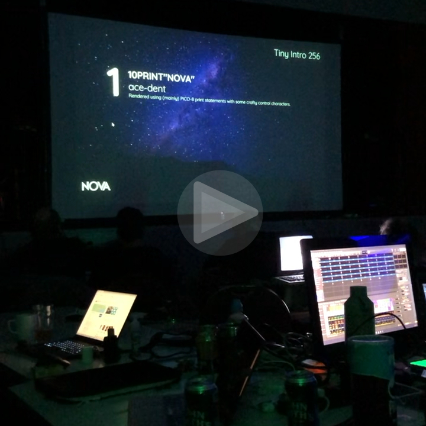

# 10PRINT"NOVA"

Tiny 256 byte Intro, written at the NOVA 2024 party.  
First demo party, first entry and first time size coding! Fresh off the press, 1 day party production 😅.  

Rendered using (mainly) PICO-8 print statements with some crafty P8SCII control characters [(1)](https://pico-8.fandom.com/wiki/P8SCII_Control_Codes)[(2)](https://pico-8.fandom.com/wiki/P8SCII). I think it demonstrates quite an interesting way to encode bitmaps.


```lua
--10print"nova"
--by ace_dent for nova 2024
x=140?"⁶@56000003⁸x⁸⁶!5908ヲヲヲヲヲヲヲヲ◝◝◝◝\0\0\0\0?○◝◝ヲヲヲヲヲヲヲヲヲヲユナ\0\0\0\0゜?○◝ユナら█\0\0\0\0¹³⁷⁷ᶠᶠ゜゛><|xヲユユナナらら██\0\0\0\0\0\0\0\0\0▒▒れれフ◝◝◝~<⁷³³¹¹\0\0\0|<>゛゜ᶠᶠ⁷█らナナユユヲx³³⁷⁷◝◝◝◜"
::a::i=(sin(x/500)*150)-100circ(98+i,54,40+(i/5),9)circ(98+i,54,25+(i/2),10)cursor(i,32,2)?"ᵉ⁶pabbc000fbg0ng\na00a00000hjmhj\na00de0000iklioe\n⁶1⁶c"
x=x+1goto a
```

<br>


<br>


## Acknowledgements

Code was optimized with the excellent [PXA Viz](https://carlc27843.itch.io/pico-8-source-compression-visualizer) tool by @carlc27843.

Special thanks to the NOVA event team, inc. @rc55 and @djh0ffman; Dave84 for encouragement and guidance when I wavered! Thanks to ne7 who created ASCII art for everyone's handle.


## Legal

Produced by Andrew C.E. Dent and shared under MIT License; please read the separate LICENSE file.

All trademarks are the property of their respective owners. PICO-8 and Picotron are trademarks of [Lexaloffle Games LLP](https://www.lexaloffle.com/).


---


## DevLog

### Artwork

12:00 - Hacking away with Affinity Designer to try and make some tiling version of the NOVA logo.  
13:00 - After the challenge to convert the vector logo into 8x8px tile artwork, we can start to create and test a tileset using [Pulp](https://play.date/pulp/) for PlayDate.  
13:08 - So far the `N` takes 6 tiles.  
14:00 - Adding down slopes for `V` and `A`, now at 9 tiles.  
14:15 - All tiles done. Cheeky re-use of one (adds 2x junk pixels), saves a tile. Giving total 15 (x8 --> ~120 bytes). `O` is still to be drawn. Plan was using a circle, but perhaps could be tiles if there's room at the end...? Now need to get something in PICO-8.  
14:35 - Use ImageMagick to slice up Pulp export into individual tiles.  
15:26 - Back to Pulp to try tweaking the logo design a little, for thinner horizontal lines.  
16:00 - New design looks better. Make tiles and convert to P8 code.  
16:14 - Just spotted a couple of pixels off in the artwork. One is a quick fix, the other would add a tile to the leading stroke of `V`, so will ignore it.  
21:42 - If bytes allow, can scroll with cursor(-x), or flip 90deg and scroll... this would allow a bigger logo effect...  
12:00 - Achieved a decent bouncy scroll. Yay!

### Coding

14:45 - Repurposing a bash script to convert png tiles into P8 code snippets  
15:05 - We have an `N`! 🎉  
15:12 - Drawing full tileset logo in P8. Concern is that the print code takes 74chrs (unoptimized). Perhaps I should have stored artwork at half-height and then doubled on rendering...?  
15:24 - Playing around with P8 font modifier [effects](https://pico-8.fandom.com/wiki/P8SCII_Control_Codes#Changing_character_rendering_modes). Not sure I like the thicker horizontal lines in the artwork.  
16:05 - Quick hack to draw oval in place of `O` to complete the logo. Looking good. Taking a break to recharge and may head to the party!  
20:30 - Back in the saddle... At NOVA! Sizecoding first to see what we have to work with...  
20:45 - Double checking how the tile data is stored; counting repetitions.  
21:10 - Combined the tile set into one data stream, embedded in the file. 154 chrs.  
21:15 - Now optimize the print stream for drawing the logo.  
21:30 - Break!  
23:15 - Work a bit on presentation. Let's get this vertically centred! 128-(3*8*2)=80. Need 40px at top- 5 rows (single spaced). Repeat line feeds "\*5\n" → "¹5\n" →  vertical cursor move "⁴🅾️" approx.  
00:08 - Fixed typo breakage. Trying to pick some nicer colors and make things look nicer with teletype printing.  
01:00 - Grateful to Dave for guidance on exporting [rom](http://www.sizecoding.org/wiki/PICO-8#Tiny_ROM_Export), is PXA compressed. May be able to do some scrolling. Now I have cut a release ROM, will try to go a bit further.  
09:10 - Around 2am(!), satisfied I can pack a nicer scrolling logo; will start to back-port the hacked together version.  
09:40 - Tweaking scrolling function using sine to get a nice back-and-forth oscillation.  
10:00 - Finally happy with how this little demo looks. Now size coding to check we can fit!  
10:30 - Size coding - go! Concatenated and comments removed, compressed ROM is 259 bytes!  
10:35 - Hacking with [PXA Viz](https://carlc27843.itch.io/pico-8-source-compression-visualizer) to grab those 3 bytes!!  
10:50 - Plan is to rearrange tile data for better compressibility. Spent 1.5hr on this. No joy but improved scripting!  
11:30 - Finally saved the bytes. Making the tile map 'text' more compressible.  
12:00 - `EXPORT -T 10PRINT"NOVA".P8.ROM` Submitted first 256b compo entry! 🥳  

<hr>

## Epilogue

🏆 Happily placed 7th out of 10, with some great entries in the category.   
[ [demozoo](https://demozoo.org/parties/4693/#competition_18960) | [pouët](https://www.pouet.net/prod.php?which=97189) | [scene.org](https://files.scene.org/view/parties/2024/nova24/tiny_intro_256/10print-nova-.p8.rom.zip) ]

Really wonderful experience of attending- amazing, talented people- all very welcoming. It was a bit stressful coding at the party, so will try to prepare an entry in advance next year 😅. Fantastic to see presented on the Big Screen!

<br>

<a href="https://raw.githubusercontent.com/ace-dent/demo-toybox/main/NOVA2024/assets/video.mp4">
    
<a>

### Future improvements

Some ideas that may improve or minimise the Intro, or be of use in future work:
- Work with [Shrinko8](https://thisismypassport.github.io/shrinko8/) by @thisismypassport.
- Smarter maths to avoid `()` using precedence; optimize for PXA compression.
- `⁶h` set a new cursor [home position](https://pico-8.fandom.com/wiki/P8SCII_Control_Codes#Homing_the_cursor), to avoid padding rows with empty tiles.
- Try storing bitmaps in hex decimal form rather than P8SCII, as the digits may compress better. This won't work for poking with `\^!` (must be raw binary), only for one-off characters. E.g. using `\^:000102030405060708` instead of `\^.\0¹²³⁴⁵⁶⁷⁸` , if `0` symbol repeats often. Experimenting with these tiles, shows worse compression with hex codes.
- Order the tile with the longest run of trailing zeroes, to be stored last (and bytes truncated to use memory default `0x00`). But PXA is pretty effective at compressing those runs, so may not help.
- Store the code to setup 8x8 font `⁶@56000003⁸x⁸` at the end of another print statement (e.g. tile map) as `⁶!5600⁸x⁸` (saves 4 chrs and may compress better). Note: Must not follow another `⁶!01ab` continuous memory write.
- When the tile map is 4 or more rows, (i.e. `\n`x3+), try multi line print statement `[[...]]`. Also, multiple end of line symbols `␊` may compress better overall.
- Consider brighter colours that will show up better on projected Big Screen. (i.e. is `2` too dark?). Use the secret palette at a cost of +1 symbol (e.g. `-3`).
- Always check if constants can be [minimized](https://www.lexaloffle.com/bbs/?tid=44801). 
- Shorten assignments `x+=1`.
- Check if constants can be tweaked (`98`>`100`, etc.).
- Try replacing some blanks in the tile map with more compressible symbols that occur in the code (e.g. `0000` > `urso`).

With just some of these tricks, an *expanded* form of the code can be compressed to 254 bytes.

```lua
x=140
?"⁶!5908ヲヲヲヲヲヲヲヲ◝◝◝◝\0\0\0\0?○◝◝ヲヲヲヲヲヲヲヲヲヲユナ\0\0\0\0゜?○◝ユナら█\0\0\0\0¹³⁷⁷ᶠᶠ゜゛><|xヲユユナナらら██\0\0\0\0\0\0\0\0\0▒▒れれフ◝◝◝~<⁷³³¹¹\0\0\0|<>゛゜ᶠᶠ⁷█らナナユユヲx³³⁷⁷◝◝◝◜"
::a::
i=sin(x/500)*150-100
circ(98+i,54,40+i/5,9)
circ(98+i,54,25+i/2,10)
cursor(i,32,2)
?[[ᵉ⁶pabbc000fbg0ng
a00a00000hjmhj
a00de0000iklioe⁶1⁶c⁶!5600⁸x⁸]]
x+=1
goto a
```