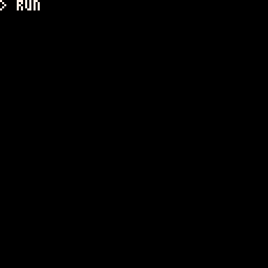

# 10PRINT"NOVA"

256 byte demo, written at the NOVA 2024 party.

Rendered using (mainly) PICO-8 print statements with some crafty control characters.
First demo party, first entry and first time size coding! Fresh off the press, 24hr production 😅.


```lua
--10print"nova"
--by ace_dent for nova 2024
x=140?"⁶@56000003⁸x⁸⁶!5908ヲヲヲヲヲヲヲヲ◝◝◝◝\0\0\0\0?○◝◝ヲヲヲヲヲヲヲヲヲヲユナ\0\0\0\0゜?○◝ユナら█\0\0\0\0¹³⁷⁷ᶠᶠ゜゛><|xヲユユナナらら██\0\0\0\0\0\0\0\0\0▒▒れれフ◝◝◝~<⁷³³¹¹\0\0\0|<>゛゜ᶠᶠ⁷█らナナユユヲx³³⁷⁷◝◝◝◜"
::a::i=(sin(x/500)*150)-100circ(98+i,54,40+(i/5),9)circ(98+i,54,25+(i/2),10)cursor(i,32,2)?"ᵉ⁶pabbc000fbg0ng\na00a00000hjmhj\na00de0000iklioe\n⁶1⁶c"
x=x+1goto a
```

<br>

<br>


---


## DevLog

### Artwork

Start - Hacking away with Affinity Designer to try and make some tiling version of the NOVA logo.
13:00 After the challenge to convert the vector logo into 8x8px tile artwork, we can start to create and test a til  eset using [Pulp](https://play.date/pulp/) for PlayDate.  
13:08 So far the `N` takes 6 tiles.  
14:00 Adding down slopes for `V` and `A`, now at 9 tiles.  
14:15 All tiles done. Cheaky re-use of one (adds 2x junk pixels), saves a tile. Giving total 15 (x8 --> ~120 bytes). `O` is still to be drawn. Plan was using a circle, but perhaps could be tiles if there's room at the end...? Now need to get something in PICO-8.  
14:35 Use ImageMagick to slice up Pulp export into individual tiles.  
15:26 Back to Pulp to try tweaking the logo design a little, for thinner horizontal lines.  
16:00 New design looks better. Make tiles and convert to P8 code.  
16:14 Just spotted a couple of pixels off in the artwork. One is a quick fix, the other would add a tile to the leading stroke of `V`, so will ignore it.  
21:42 If bytes allow, can scroll with cursor(-x), or flip 90deg and scroll... this would allow a bigger logo effect...
12:00 Achieved a decent bouncy scroll. Yay!

### Coding

14:45 Repurposing a bash script to convert png tiles into P8 code snippets  
15:05 We have an `N`! 🎉  
15:12 Drawing full tileset logo in P8. Concern is that the print code takes 74chrs (unoptimized). Perhaps I should have stored artwork at half-height and then doubled on rendering...?  
15:24 Playing around with P8 font modifier [effects](https://pico-8.fandom.com/wiki/P8SCII_Control_Codes#Changing_character_rendering_modes). Not sure I like the thicker horizontal lines in the artwork.  
16:05 Quick hack to draw oval in place of `O` to complete the logo. Looking good. Taking a break to recharge and may head to the party!  
20:30 Back in the saddle... At NOVA! Sizecoding first to see what we have to work with...  
20:45 Double checking how the tile data is stored; counting repeatitions.  
21:10 Combined the tile set into one data stream, embedded in the file. 154 chrs.  
21:15 Now optimize the print stream for drawing the logo.  
21:30 Break!  
23:15 Work a bit on presentation. Let's get this vertically centered! 128-(3*8*2)=80. Need 40px at top- 5 rows (single spaced). Repeat line feeds "\*5\n" → "¹5\n" →  vertical cursor move "⁴🅾️" approx.  
00:08 Fixed typo breakage. Trying to pick some nicer colors and make things look nicer with teletype printing.  
01:00 Grateful to Dave for guidance on exporting [rom](http://www.sizecoding.org/wiki/PICO-8#Tiny_ROM_Export), is PXA compressed. May be able to some scrolling. Now I have cut a release ROM, will try to go a bit further.  
09:10 Around 2am, satisified I can pack a nicer scrolling logo; will start to back-port the hacked together version.  
09:40 Tweaking scrolling function using sine to get a nice back-and-forth oscillation.  
10:00 Finally happy with how this little demo looks. Now size coding to check we can fit!  
10:30 Size coding - go! Concatenated and comments removed, ROM is 259 bytes!  
10:35 Hacking with [PXA Viz](https://carlc27843.itch.io/pico-8-source-compression-visualizer) to grab those 3 bytes!!  
10:50 Plan is to rearrange tile data for better compressability. Spent 1.5hr on this. No joy but improved scripting!  
11:30 Finally saved the bytes. Making text more compressible. 
12:00 `EXPORT -T 10PRINT"NOVA".P8.ROM` Submitted first 256b compo entry! 🥳
