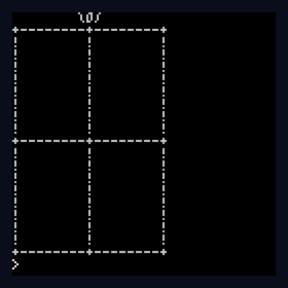

# Vintage Computing Christmas Challenge 2024

The Vintage Computing Christmas Challenge (VCCC / VC³) is a size coding challenge for retro computers. Details [here](https://www.logiker.com/Vintage-Computing-Christmas-Challenge-2024). This year's challenge is to draw a Christmas present 🎁 in ASCII characters, with minimal code.

```text 
        \o/
+--------+--------+
!        !        !
!        !        !
!        !        !
!        !        !
!        !        !
!        !        !
!        !        !
!        !        !
+--------+--------+
!        !        !
!        !        !
!        !        !
!        !        !
!        !        !
!        !        !
!        !        !
!        !        !
+--------+--------+
```


## Information theory

The ASCII art is 19 characters wide (1+8+1+8+1) and 20 characters high (1+1+8+1+8+1). Allowing for a new line symbol on each row, gives 20 x 20 x 1 byte per character; directly encoding the image requires 400 bytes (e.g. as a text file). 

We can do a little better by removing the trailing whitespace on the first row, after the bow 🎀 . 

```text 
␠_␠_␠_␠_\o/␤
```

The first line can be reduced from 20 to 12 characters (8 spaces, 3 characters and 1 new line).  Additionally, we don't need a newline on the final row. This reduces the direct encoding by 9 bytes to **391 bytes** ([ascii.txt](./assets/ascii.txt)).

We can see there are duplicated structures in both x- and y-directions. Hopefully this redundancy can be exploited in our program. To get a measure of the actual _information_ content, we can use `xz` to produce a compressed LZMA stream without a container format.

```bash
xz --compress --keep --format=raw -9 -e --suffix=.lzma ascii.txt
```

This gives us a file of 34 bytes or 272 bits. For essentially 364 symbols (19*19 +3), each symbol has on average ~0.8 bits of information. 


Encoding as PNG

greyscale can hold ascii values in single byte here. To help visualize, I have prepared a colorized version scaled up:


<br>

Optimized file is 90 bytes, but contains overhead of container format. The actual bitmap data stored in the `IDAT` chunk is 33 bytes. This is inline with our result using LZMA.

Since our code must have some overhead for rendering and decoding, an absolute minimum is likely to be ~ **40 bytes**.


## Main entry (PICO-8)

Although not 'vintage', allowable.

Rendered using PICO-8 print statements with some crafty P8SCII control characters [(1)](https://pico-8.fandom.com/wiki/P8SCII_Control_Codes)[(2)](https://pico-8.fandom.com/wiki/P8SCII).

```lua
--vccc2024 in 66 chars
--by ace-dent
?"³♥\\o/"
for ♥=0,18do?({"+¹8-+¹8-+","!³♥!³♥!"})[min(♥%9,1)+1]
end
```

Downloadable rom file is [here](vccc2024.p8.rom) (66 bytes).


<br>



<br>


## Wild entry – 'Pressie'

I wanted to run with the gift theme. Some P8SCII to unwrap.

Use punycode if copy & pasting.<kbd>Ctrl</kbd>+<kbd>P</kbd>

```lua
--pressie in 76 chars
--by ace-dent
?[[⁶c1⁶p

	⁶.0Pナ~◝kミw⁶.⁶⁵³?○s{s
	⁶.◝U◝gワg◝~⁶.○U○s{s○?⁶!5f2c³]],-rnd(3))
run()
```

Downloadable rom file is [here](wild-entry/pressie.p8.rom) (76 bytes).

This is a tiny 'Pressie', with a flashing Christmas light effect. Entirely rendered in one print statement, this screen filling bitmap takes 76 characters. Note: the `run()` loop executes very tightly, so it may take a few attempts to <kbd>escape</kbd> the program. 


<br>


<br>


## Acknowledgements

Compression tested with the excellent [PXA Viz](https://carlc27843.itch.io/pico-8-source-compression-visualizer) tool by @carlc27843 and [Shrinko8](https://thisismypassport.github.io/shrinko8/) by @thisismypassport.

Special thanks to the organizer @logiker464 for this excellent challenge. My ASCII art name tag was created by ne7.

Tools:
- https://thisismypassport.github.io/shrinko8/
- https://itch.io/jam/pico-1k-2024


## Legal

Produced by Andrew C.E. Dent and shared under MIT License; please read the separate LICENSE file.

All trademarks are the property of their respective owners. PICO-8 and Picotron are trademarks of [Lexaloffle Games LLP](https://www.lexaloffle.com/).


---


## PICO-8 - devlog

Testing done with [PXAViz](https://carlc27843.itch.io/pico-8-source-compression-visualizer) and 
Avoid `cls()`, as this is hot on PXA. Escape the slash `\\`.

### 1. Naive approach

Compression using - `EXPORT -T VCCC2024.P8.ROM`  Exporting a code-only compressed file
is possible since version 0.2.4.c

```lua
?"        \\o/"
?"+--------+--------+"
?"!        !        !"
?"!        !        !"
?"!        !        !"
?"!        !        !"
?"!        !        !"
?"!        !        !"
?"!        !        !"
?"!        !        !"
?"+--------+--------+"
?"!        !        !"
?"!        !        !"
?"!        !        !"
?"!        !        !"
?"!        !        !"
?"!        !        !"
?"!        !        !"
?"!        !        !"
?"+--------+--------+"
-- 452 chars / 56 bytes PXA compressed
```

### 2. Less naive approach

Can we help the PXA compression a little? Sure! We can combine all the rows into a multi-line print statement, to avoid some overhead of the duplicated `?"..."` wrapper.

```lua
?[[        \o/
+--------+--------+
!        !        !
!        !        !
!        !        !
!        !        !
!        !        !
!        !        !
!        !        !
!        !        !
+--------+--------+
!        !        !
!        !        !
!        !        !
!        !        !
!        !        !
!        !        !
!        !        !
!        !        !
+--------+--------+]]
-- 396 chars / 53 bytes PXA compressed
```

I think 53 bytes represents the best we can do with PXA compression and is close to the 40 byte minimum I specified... BUT!... The VCCC competition rules excludes the use of these built in file compressors, to level the playing field and encourage some *actual* coding!


### 3. Coding patterns

Ok, first effort to code something.
Exploit repetitions in the symbols.

```lua
h="+\*8-+\*8-+"
v="!\*8 !\*8 !"
?"\*8 \\o/"
?h
for i=1,8do?v
end?h
for i=1,8do?v
end?h
-- 86 chars / 61 bytes PXA compressed
```
Increased entropy, as PXA compression decreases from 53 to 61 bytes.

### 4. Hacking with PETSCII

Multiple characters
Replace spaces with horizontal offsets
Combine some lines of the for loop to avoid whitespace.

```lua
h="+¹8-+¹8-+"v="!³♥!³♥!"
?"³♥\\o/"
?h
for j=1,2do for i=1,8do?v
end?h
end
-- 73 chars / 68 bytes PXA compressed
```

### 5. Packing with tables

```lua
o={"+¹8-+¹8-+","!³♥!³♥!"}?"³♥\\o/"
for n=0,18do?o[min(n%9,1)+1]
end
-- 67 chars / 72 bytes PXA compressed
```
--  using tables and single for loop

### 6. Last byte

```lua
?"³♥\\o/"
for n=0,18do?({"+¹8-+¹8-+","!³♥!³♥!"})[min(n%9,1)+1]
end
-- 66 chars / 73 bytes PXA compressed
```
-1 chr directly assign table
This is the best solution I could achieve. In experimenting with more complex schemes, the overhead was too great.

### 7. Bonus: Fancy printing

Using the 'forbidden' [palette](https://nerdyteachers.com/PICO-8/Guide/?PALETTES), which provides a nice colour ramp going from `-1` to `-8`.
Add pauses for a teletype effect.

```lua
cls()
h="\^d1+¹8-+¹8-+"v="!³♥!³♥\^d2!"
?"³♥\\o/"
?h
for f=1,2do for f=1,8do?v,-f
end?h
end
```


<hr>

## Epilogue

TBC