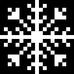

# Vintage Computing Christmas Challenge 2025 ❄️

The Vintage Computing Christmas Challenge (VCCC / VC³) is a size coding challenge for retro computers, run by the venerable [@logiker](https://bsky.app/profile/logiker.bsky.social). Competition details are [here](https://www.logiker.com/Vintage-Computing-Christmas-Challenge). 

This year's challenge is to draw a Snowflake ❄️ with the `*` ASCII character, with minimal code.

```text 
         *
       * * *
  * *   ***   * *
   **    *    **
  ***  * * *  ***
     *  ***  *
      *  *  *
 *  *  * * *  *  *
  *  *  ***  *  *
*******************
  *  *  ***  *  *
 *  *  * * *  *  *
      *  *  *
     *  ***  *
  ***  * * *  ***
   **    *    **
  * *   ***   * *
       * * *
         *
```

---

## ❅ Analysis ❅

We can consider how much information /entropy is actually present in the message, to determine the minimum bytes needed to represent it. This gives a nice target to aim for. For the 2024 challenge I [predicted](https://github.com/ace-dent/demo-toybox/tree/main/VCCC2024#information-theory) 34-40 bytes, and the smallest program was 34 bytes (APL) and the second smallest 41 bytes (ASM).

The ASCII art is 19 characters wide (9+1+9) and 19 characters high (9+1+9), as shown in this diagram (adapted from the challenge [image](https://logiker.com/data/_uploaded/image/VCCC/vccc2025_topic_numbered.png)) ~

```text
         9
       * 8 *
  * *   *7*   * *
   **    6    **
  ***  * 5 *  ***
     *  *4*  *
      *  3  *
 *  *  * 2 *  *  *
  *  *  *1*  *  *
9876543210123456789
  *  *  *1*  *  *
 *  *  * 2 *  *  *
      *  3  *
     *  *4*  *
  ***  * 5 *  ***
   **    6    **
  * *   *7*   * *
       * 8 *
         9
```

Allowing for a new line symbol on each row, gives 20 x 19 characters; naively encoding the image (with all paddings spaces) as a text file requires 380 bytes. We can do a little better by removing the trailing whitespace, with one line feed character per row:

$(11+13+18+17+18+15+14+19+18)+20+(18+19+14+15+18+17+18+13+11)$

Subtracting the terminal line feed, gives us 143+20+143-1 = 305 bytes (saving 75 bytes) as a plain text file ([ascii.txt](./assets/ascii.txt)).

We can see there are duplicated structures in both x- and y-directions, and more complex four-fold symmetry. Hopefully this redundancy can be exploited in our program. To get a measure of the actual _information_ content, we can use `xz` to produce a compressed LZMA stream without a container format.

```bash
xz --compress --keep --format=raw -9 -e --suffix=.lzma ascii.txt
```

This gives us a file of 77 bytes or 616 bits. For essentially 361 symbols (19*19), each symbol has ~1.7 bits of information. The low bit rate is due to the limited symbols `␠`|`*`|`␊` and the repeating patterns. (Note: the bitrate is double that of 2024, as the design is more complex).

We can also estimate the information content, by encoding it as a PNG image. This file format exploits x-/y-repetition with [delta filtering](https://www.w3.org/TR/PNG-Filters.html) as a first step in compression. Each ASCII character can be stored as a binary value (1 bit per pixel) in a bitmap image of 19x19 pixels ([here](assets/snowflake.png)).



The optimised PNG file is 122 bytes, which includes the overhead of a container format. The actual bitmap data stored in the `IDAT` chunk is just 65 bytes. This is a little smaller than the LZMA result (~85% of the size).

### Conclusion
Since our code must have some overhead for rendering and decoding, a minimum is likely to be ~ **❄️ 70 bytes ❄️** for a program.
